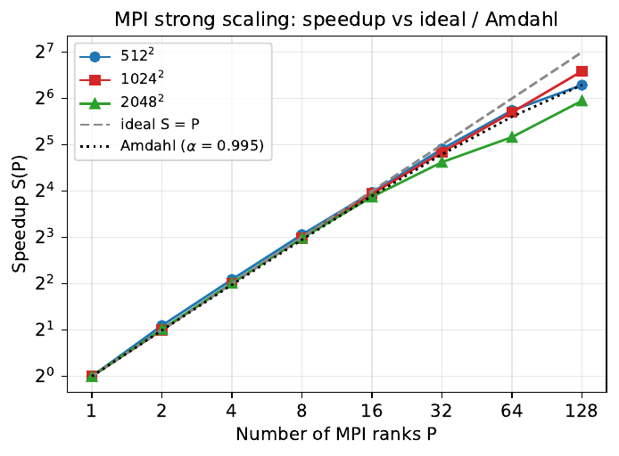
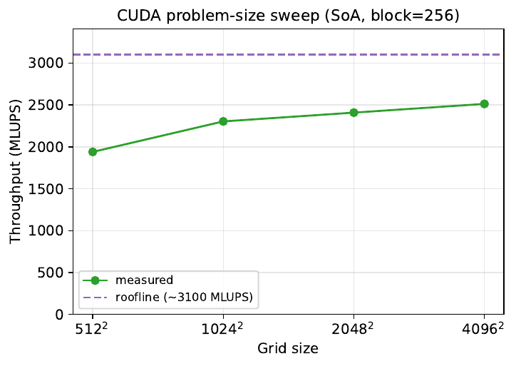

# Lattice Boltzmann on MPI and CUDA — a performance study

[](https://github.com/Kikidu59/LBM-mpi-cuda/actions/workflows/ci.yml)


Parallelisation of a 2D **lattice Boltzmann** fluid solver (D2Q9, BGK) — flow past a cylinder producing a Kármán vortex street — with **MPI** on a CPU cluster and **CUDA** on a V100 GPU, followed by a performance study against Amdahl, Gustafson and a memory-bandwidth roofline.

Final project of EPFL's *MATH-454 Parallel and High Performance Computing* (spring 2026), run on the SCITAS clusters Jed (CPU) and Izar (GPU).

📄 **[Report (3 pages)](report/report.pdf)** · 🖥️ **[Slides](presentation/slides.pdf)**

## Headline results

All three versions reproduce the Strouhal number **St = 0.1600** of the vortex street at Re = 100 (literature value ≈ 0.16).

| Version | Hardware | Throughput (800 × 400 grid) | vs. serial |
|---|---|---:|---:|
| Serial (provided baseline) | 1 CPU core | 20.3 MLUPS | 1× |
| MPI | 16 ranks, 1 node | 198 MLUPS | ~10× (≈ 99 % parallel efficiency) |
| CUDA | 1 × V100 | **2051 MLUPS** | **~101×** |

MLUPS = million lattice-cell updates per second, computed identically in every version (global grid, slowest rank).

| MPI strong scaling (up to 128 ranks, 2 nodes) | CUDA: problem-size sweep vs. roofline |
|:---:|:---:|
|  |  |

- **MPI strong scaling** — 1024² reaches a **96× speedup on 128 ranks (75 % efficiency)**. The gap to ideal is *not* Amdahl's serial fraction (< 1 % from profiling): small grids become communication-bound (thin slabs), large grids become memory-bandwidth-bound as cores share a node.
- **MPI weak scaling** — throughput grows from 29 to 1434 MLUPS (1 → 128 ranks, 128 rows each), but efficiency drops to 39 %. Communication per rank is constant, so the loss comes from shared memory-bandwidth saturation and the inter-node step.
- **CUDA** — up to **2513 MLUPS on 4096²**, i.e. ~81 % of the bandwidth roofline (900 GB/s ÷ 288 B per update ≈ 3100 MLUPS). Switching the layout from array-of-structures to **structure-of-arrays gives 3.6×** through coalesced memory access — the single biggest optimisation.

## What was built

**MPI version** ([`mpi/`](mpi/))
- 1D domain decomposition along y, with balanced remainder rows and one ghost row per side.
- Halo exchange of all 9 populations packed into one contiguous message per side, using deadlock-free `MPI_Sendrecv`. Only streaming needs neighbours, so it is the only phase that communicates.
- Physical boundaries are tested in global coordinates. The result is **bit-identical to the serial code** for any number of ranks, including uneven splits, and this is checked in CI.

**CUDA version** ([`cuda/`](cuda/))
- One thread per cell and one kernel per phase (collide, bounce-back, stream, inlet, outlet).
- SoA layout by default; `make LAYOUT=AOS` builds the array-of-structures variant for the layout study.
- Double-buffered streaming by pointer swap. There are no host↔device transfers in the time loop: the probe is accumulated on the device and copied back once.

**Performance study** ([`plotting/`](plotting/), [`report/`](report/))
- Profiled the serial code with gprof: collide 55 % and stream 41 % of the runtime.
- Measured strong and weak scaling on Jed (Slurm scripts in `mpi/`), plus block-size, problem-size and layout sweeps on Izar (`cuda/`).
- Compared every measurement to a model: Amdahl, Gustafson and the V100 roofline. All raw numbers live in CSVs, and every figure is regenerated from them by a script.

## Repository layout

```
serial/        reference serial solver — provided by the course, used as baseline
mpi/           MPI version + Slurm scripts (validation, strong and weak scaling)
cuda/          CUDA version + Slurm scripts (validation, block/size/layout study)
viz/           vorticity animation and Strouhal-number scripts — provided by the course
plotting/      measured data (CSV) and the scripts that turn it into figures
report/        3-page report (LaTeX source + PDF)
presentation/  4-slide talk (LaTeX source + PDF)
tests/         serial-vs-MPI equivalence check
```

Each code folder has its own README with build and run instructions.

## Quick start

```bash
# Serial baseline (needs HDF5)
make -C serial
cd serial && mkdir -p out && ./lbm nx=400 ny=100 steps=20000 && cd ..

# MPI
make -C mpi
mpirun -np 4 mpi/lbm_mpi nx=800 ny=400 re=100 steps=60000 probe=probe.csv
python3 viz/strouhal.py probe.csv --u-in 0.05 --diameter 20     # → St ≈ 0.16

# CUDA (on a machine with nvcc and an NVIDIA GPU)
make -C cuda                   # SoA build;  make -C cuda LAYOUT=AOS for AoS
cuda/lbm_cuda nx=800 ny=400 re=100 steps=60000 block=256 probe=probe.csv

# Check that MPI reproduces the serial run bit for bit
tests/check_mpi_matches_serial.sh

# Regenerate all figures from the measured data
cd plotting && for s in plot_*.py; do python3 "$s"; done
```

On the SCITAS clusters, submit the Slurm scripts from inside `mpi/` or `cuda/`, for example `cd mpi && sbatch slurm_strong.sh`.

## Credits

The serial solver (`serial/`) and the visualisation scripts (`viz/`) were provided as the project's starting point by the MATH-454 teaching team. The MPI and CUDA versions, the Slurm benchmarking scripts, the plotting pipeline, the report and the slides are the work of this project.
